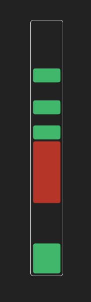

# 1D Physics Example

A stack of boxes in 1 dimension. Click and drag them to see them move and collide. [Click here for live demo](https://ianjbryant.github.io/1dPhysics/).

  

## How it works:
This demo uses fixed point values through JavaScript's "TypedArrays". I don't think this is necessary but it means there is no slop when moving box bounds in tandem. Each box has a top, a bottom, and a velocity. In each tick, we make a copy of each velocity and call it the "displacement". We advance all boxes along their displacements and check if the order of the boxes has changed. If it has, a collision has occured, so we undo the last move and instead move every box by *half* its displacement. If this succeeds we subtract the current displacement fraction from the displacement, halve the displacement fraction again and continue in this loop until one or more boxes reaches a displacement fraction which cannot be halved any further. In this way we make our boxes recursively approach their collisions. At this point we look at pairs of boxes that are touching each other where at least one of the boxes has a velocity pointed towards the other box. We consider these collisions, and to compute their result we just set the velocity and displacement of both boxes to the average of those two respective values between the two boxes. This all continues in a loop while any box has any remaining unconsumed displacement. Once all displacement has been consumed, the tick is over.
